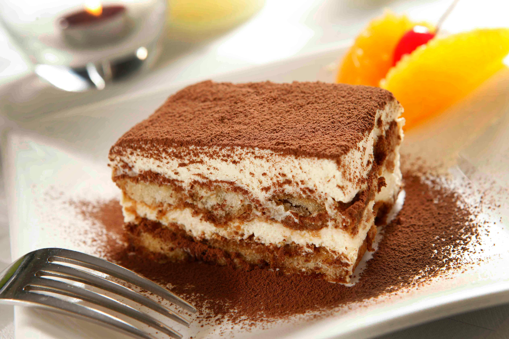

# Menu

## Pizza

| Nazwa | Opis | Cena |
|------|-------------|-------|
| Pizza Margherita | Klasyczna pizza z serem | 30 zł |
| Pizza Carbonara | Pizza z serem pecorino romano i boczkiem | 32 zł|
| Pizza Priosciutto | Pizza z serem i szynką prosciutto | 35 zł|
| Pizza Capriciosa| Pizza z mozzarellą, szynką, pieczarkami | 38 zł |
| Pizza Hawajska | Pizza z ananasem | 40 zł |
| Pizza Hot Pepperoni| Pizza z pepperoni i ostrą papryczką jalapeno | 45 zł |
| Pizza Vege| Pizza zawiera sos pomidorowy, mozzarellę, kukurydzę, pomidorki koktajlowe, paprykę, cebulę, oregano | 45 zł |
| Pizza Quatro Formaggio| Pizza z sosem kremowym, serem mozzarella, cheddar, ementaler i pleśniowym | 51 zł |

Wszystkie porcje pizzy mają średnicę 32 cm.

## Spaghetti

| Nazwa | Opis | Cena |
|------|-------------|-------|
| Spaghetti Napoli| Klasyczne spaghetti z sosem pomidorowym napoli | 22 zł |
| Spaghetti Carbonara | Spaghetti z serem i boczkiem | 25 zł|
| Spaghetti Aglio e Oglio | Spaghetti z serem, oliwą z oliwek, czosnkiem i chilli | 28 zł|
| Spaghetti Bolognese| Klasyczne spaghetti z sosem bolońskim i mięsem mielonym | 27 zł |

## Lasagne

| Nazwa | Opis | Cena |
|------|-------------|-------|
| Lasagne Zucchini| Lasagne z dodatkową cukinią | 31 zł |
| Lasagne Pepperoni | Lasagne z pepperoni | 35 zł|
| Lasagne Bolognese | Klasyczne lasagne z serem, sosem pomidorowym i mięsem mielonym | 30 zł|

## Desery

| Nazwa | Opis | Cena |
|------|-------------|-------|
| Tiramisu| Klasyczne Tiramisu podawane w pucharku | 12 zł |
| Cannolo | Chrupiące rurki z kremem z sera ricotta | 20 zł (5 szt.) |
| Panettone | Delikatna babka drożdżowa | 50 zł|